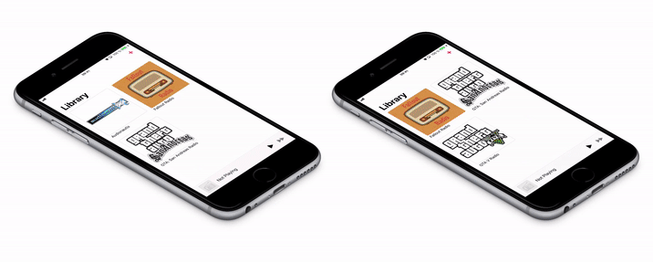

# Sim Radio

SimRadio app allows you to create the impression of listening to a live radio station on your iPhone.
Radio stations in Sim Radio are playlists with advanced control over the sequence of playback of audio files.
You can create a list of tracks, add DJ drops and intros, records of "news" and "advertisements", flexibly adjust the playback order of audio files related to different parts of the "air", playback the DJ’s voice over the audio track while gradually lowering the volume of the track itself. There is a possibility to program a random selection from a set of typical DJ phrases: it can be a description of the currently played composition, a transition to news or advertising, a wish for a good morning or evening depending on the current time of the day and some common phrases.

You can create your own “radio station”, put it somewhere where you can download it via http to SimRadio on your iPhone

## Privacy Policy

### Overview

This Privacy Policy describes how your personal information is handled in Sim Radio.

### We Collect No Personal Information Using Our Applications

We do not collect, use, save, or have access to any of your personal data recorded in Sim Radio.
Individual settings relating to the Sim Radio apps are not personal and are stored only on your device.
Our Applications Comply with the Children’s Online Privacy Protection Act.
Our applications don’t collect personal information from anyone, including children under the age of 13.

### Contact Us

If you have any questions about this Privacy Policy, feel free to get in touch with us at vorobyov.alexey@gmail.com
